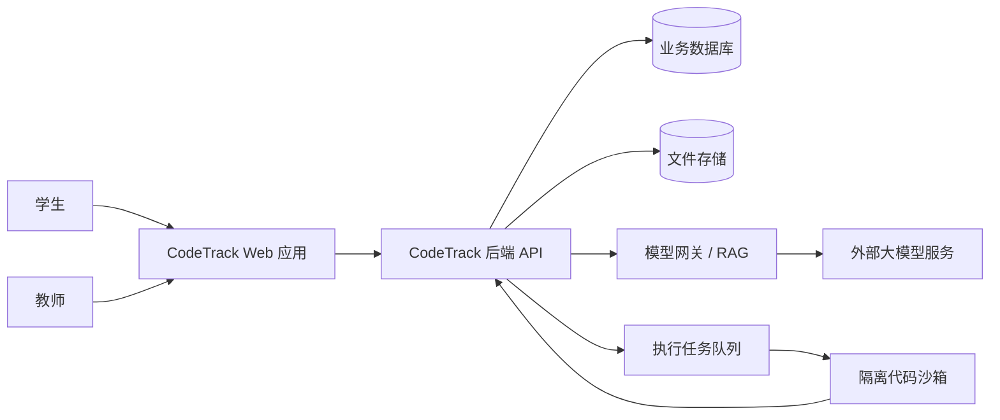

# 系统上下文设计

## 1. 系统边界

CodeTrack 系统负责：

- 课程与任务呈现；
- 学生代码提交与版本管理；
- 代码执行任务编排；
- 测试证据保存；
- 课程知识检索；
- AI 诊断与提示；
- 能力证据生成；
- 教师基础学情反馈。

系统不负责：

- 自研编译器；
- 训练基础大模型；
- 完整教务管理；
- 在线支付和商业运营；
- 生产级代码托管平台。

## 2. 外部参与者

### 学生

通过 Web 学生端完成实验。

### 教师

通过 Web 教师端查看任务和学生过程。

### 大模型服务

提供自然语言理解和生成能力。系统通过模型网关调用，避免业务代码绑定单一供应商。

### 代码运行基础设施

提供容器或其他隔离执行能力。

### 对象或文件存储

保存课程资料、上传文件和必要产物。

## 3. 上下文关系

## 4. 信任边界

重点信任边界：

1. 浏览器与后端之间：所有输入不可信；
2. 后端与沙箱之间：学生代码极高风险；
3. 后端与外部大模型之间：不得发送密钥和无关个人信息；
4. 知识库内容进入 AI 前：需带来源和权限；
5. AI 输出进入业务系统前：必须结构校验和安全过滤。

## 5. 关键设计决定

- 普通业务使用模块化单体，降低首版联调复杂度；
- 代码沙箱作为独立服务部署，形成安全边界；
- AI 通过统一模型网关调用，保留模型替换能力；
- 业务数据库保存事实和索引，原始大文件进入文件存储；
- 所有异步任务均通过任务 ID 查询状态。
