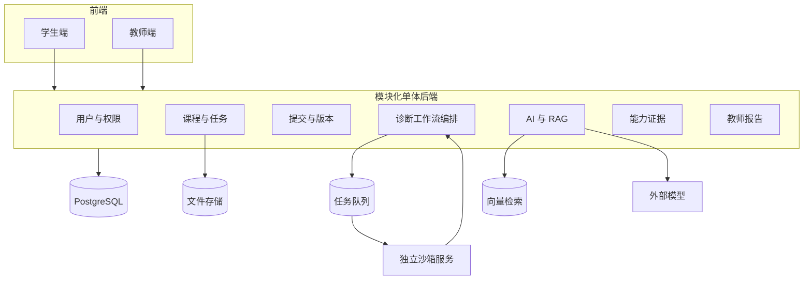

# 整体系统架构设计

**架构结论：模块化单体业务后端 + 独立沙箱执行服务**

## 1. 为什么不直接使用大量微服务

首个 Demo 的主要风险是业务闭环不通，而不是单体性能不足。大量微服务会增加：

- 接口数量；
- 部署和配置成本；
- 本地调试难度；
- 分布式日志问题；
- AI 编码工具的上下文碎片化；
- 团队联调成本。

因此普通业务先集中在一个后端应用中，通过清晰模块边界保持可拆分性。只有不可信代码执行必须单独隔离。

## 2. 分层结构

### 2.1 交互层

- 学生 Web；
- 教师 Web。

### 2.2 API 与应用层

- 身份和权限；
- 课程与任务；
- 提交与版本；
- 执行编排；
- AI 诊断；
- 提示管理；
- 能力证据；
- 教师报告。

### 2.3 基础能力层

- PostgreSQL；
- 向量检索；
- Redis 或等价任务队列；
- 文件存储；
- 模型网关；
- 沙箱执行服务。

### 2.4 安全与运维层

- 权限；
- 审计日志；
- 资源限制；
- 错误追踪；
- 健康检查；
- 配置和密钥管理。

## 3. 推荐技术基线

以下为推荐基线，正式编码前可调整：

- 前端：React + TypeScript + Vite；
- UI：成熟组件库，避免自研基础组件；
- 后端：FastAPI；
- ORM：SQLAlchemy；
- 数据迁移：Alembic；
- 数据库：PostgreSQL；
- 向量检索：pgvector 或单独轻量向量库；
- 队列：Redis + 后台 Worker；
- 沙箱：Docker 容器执行，严格资源限制；
- 接口文档：OpenAPI；
- 部署：Docker Compose；
- 测试：pytest + 前端组件/端到端测试。

选择理由：技术成熟、文档丰富、AI 编码支持较好，适合快速建立可复现 Demo。

## 4. 逻辑架构

## 5. 运行方式

学生提交后，后端立即返回提交 ID 和版本 ID，不等待代码执行完成。执行任务进入队列，前端通过轮询或事件推送获取状态。

MVP 推荐先使用轮询，简化实现：

- 提交后每 1 至 2 秒查询一次；
- 达到终态后停止；
- 超过前端等待阈值时提示后台仍在处理；
- 后端必须有独立超时，不能依赖前端中断。

## 6. 数据一致性

- 提交版本创建成功后才能创建执行任务；
- 执行记录与版本一一关联；
- 每个执行可包含多个测试结果；
- 诊断只能引用已经完成的执行记录；
- 能力证据只在执行终态和提示记录明确后生成；
- 异步任务需要幂等键，防止重复执行产生重复记录。

## 7. 后续扩展路径

MVP 稳定后可按压力拆分：

- 沙箱编排服务；
- AI 模型网关；
- 报告聚合任务；
- 知识库摄取服务。

在没有实际性能或团队边界需求前，不提前拆分。
