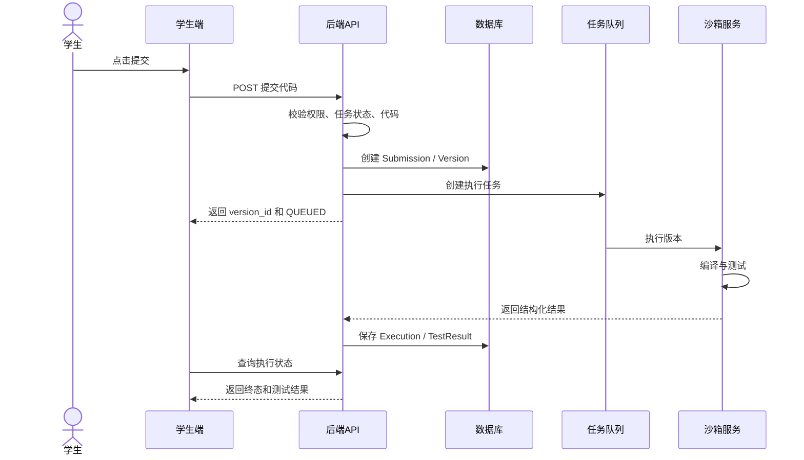
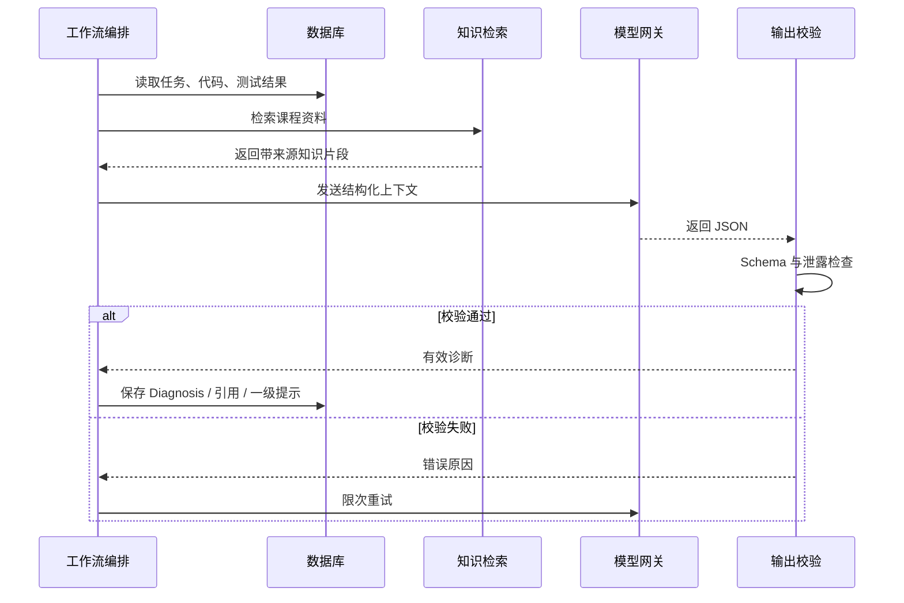
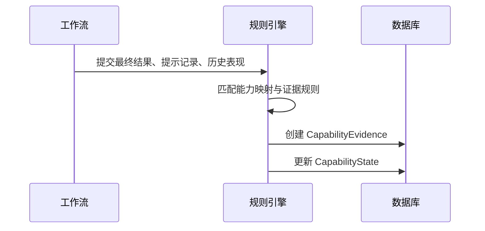

# 核心时序设计

## 1. 首次提交与执行

## 2. AI 诊断

## 3. 提示升级

1. 学生请求下一层提示；
2. 后端检查当前层级、失败次数、是否已有新提交；
3. 满足规则后返回已生成提示或触发生成；
4. 保存查看时间与层级；
5. 学生查看完整参考答案时单独记录，不等同普通提示。

## 4. 重新提交

- 同一个 `Submission` 下创建新 `SubmissionVersion`；
- 新版本必须重新执行所有必要测试；
- 不继承旧版本的通过状态；
- AI 可以读取历史诊断，但必须基于新测试结果重新判断；
- 页面展示版本时间线和前后差异。

## 5. 能力证据生成

## 6. 教师报告

- 定时或按请求聚合事实数据；
- 先生成确定性统计；
- 再把统计摘要交给 AI 生成教学建议；
- 页面分别展示“数据事实”和“AI 建议”；
- 教师可以采纳、修改或忽略建议。
