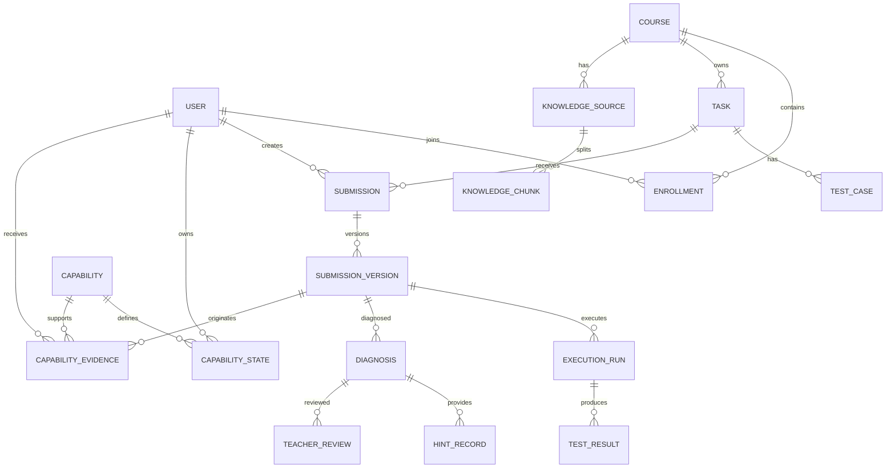

# 领域模型与实体关系

## 1. 核心实体

- User：用户；
- Course：课程；
- Enrollment：课程成员；
- Task：实验任务；
- TestCase：测试用例；
- KnowledgeSource：知识资料；
- KnowledgeChunk：检索片段；
- Submission：学生对某任务的整体提交记录；
- SubmissionVersion：一次具体代码版本；
- ExecutionRun：一次执行；
- TestResult：某执行下某测试结果；
- Diagnosis：AI 诊断；
- DiagnosisEvidenceLink：诊断与工具证据关联；
- DiagnosisSourceLink：诊断与知识来源关联；
- HintRecord：提示；
- Capability：能力点；
- CapabilityEvidence：能力证据；
- CapabilityState：学生当前能力状态；
- TeacherReview：教师复核；
- AuditLog：审计日志。

## 2. 关系

## 3. 聚合边界

### 3.1 课程聚合

Course、Task、TestCase、KnowledgeSource。

### 3.2 提交聚合

Submission、SubmissionVersion、ExecutionRun、TestResult。

### 3.3 诊断聚合

Diagnosis、EvidenceLink、SourceLink、HintRecord、TeacherReview。

### 3.4 能力聚合

Capability、CapabilityEvidence、CapabilityState。

## 4. 不可变数据

以下记录创建后不可原地修改核心内容：

- SubmissionVersion.code；
- ExecutionRun 原始结果；
- TestResult 原始结果；
- 已展示的 HintRecord 内容；
- CapabilityEvidence 来源。

需要更正时创建新记录或追加复核，不覆盖历史。

## 5. 标识设计

推荐使用 UUID 或有前缀的不可预测 ID。外部接口不暴露连续数据库自增 ID。

## 6. 时间字段

统一使用 UTC 存储，接口返回 ISO 8601；前端按用户时区展示。

## 7. 软删除

课程和任务可使用状态字段停用。核心提交、执行、诊断和能力证据不进行普通物理删除，涉及隐私删除时使用专门流程。
