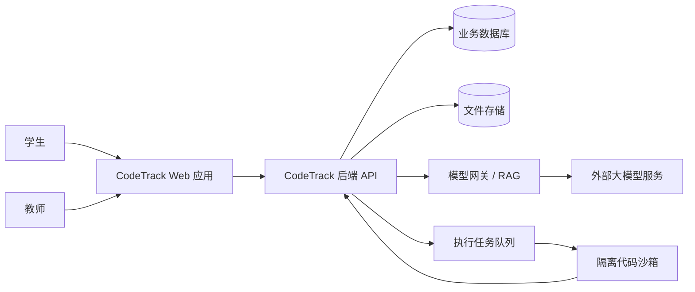
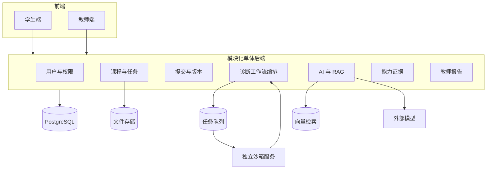
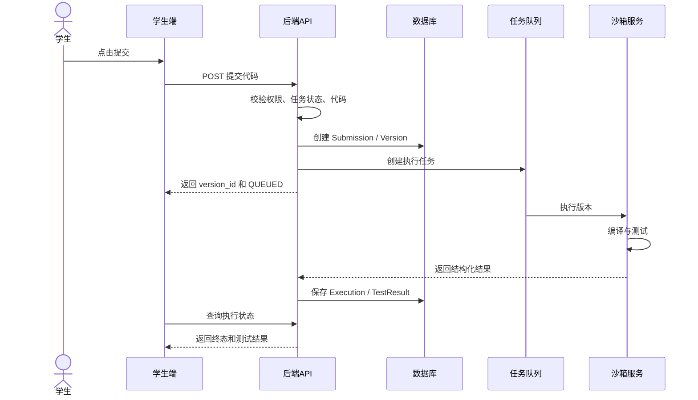
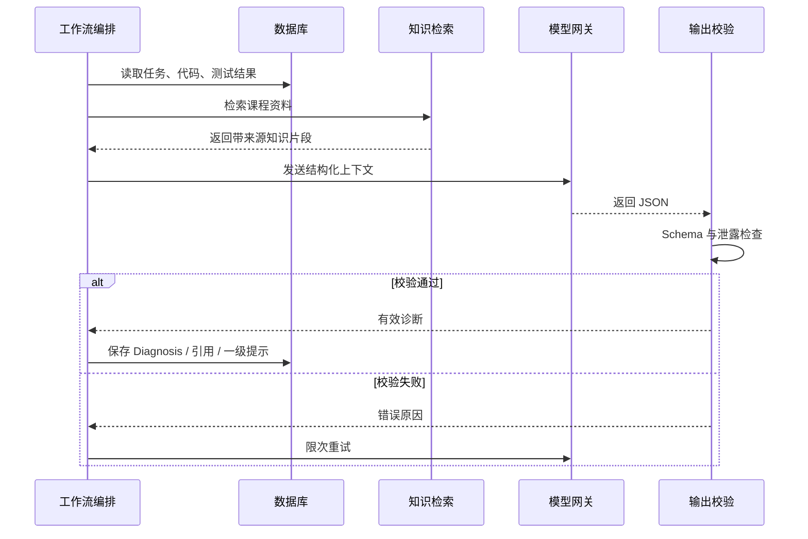
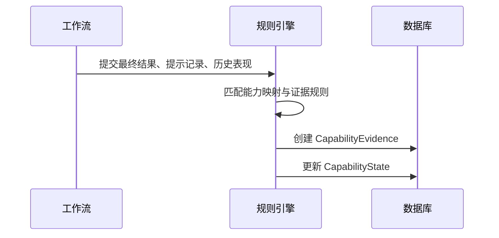
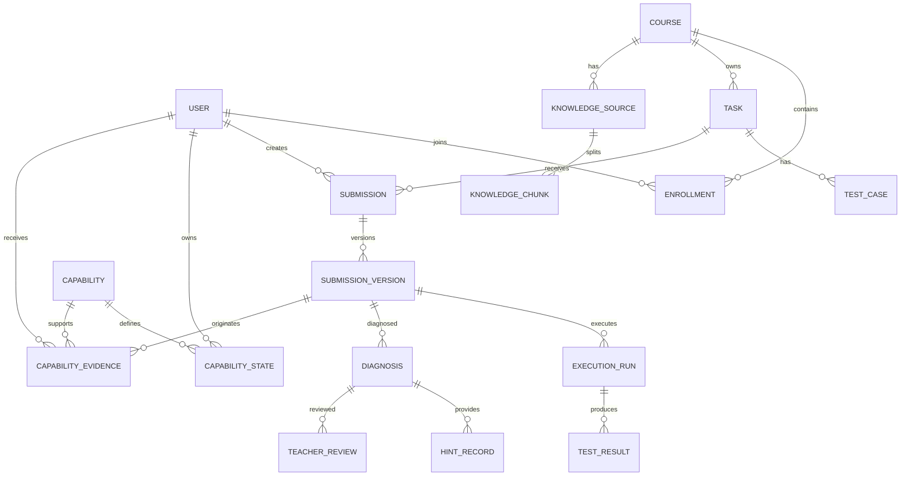

# CodeTrack 开发文档合集 V0.1

> 以下内容按文件顺序合并，实际开发请以分目录文档为准。


---

<!-- 来源文件：README.md -->

# CodeTrack 开发文档包 V0.1

## 1. 文档包用途

本目录用于把现有赛题分析和产品构想转换为可以指导团队与 AI 编码工具实施的软件工程文档。

本版只服务于第一阶段：

> 围绕数据结构课程中的“单链表删除头节点错误”，完成学生提交代码、代码执行、自动测试、AI 诊断、渐进提示、重新提交、能力证据记录和教师基础查看的首个纵向 Demo。

这不是最终产品的全部设计。科研训练、多课程扩展、完整游戏化、复杂管理端和大规模运营能力均不属于当前开发主线。

## 2. 推荐阅读顺序

1. `01_project_positioning_and_boundaries.md`
2. `02_mvp_scope.md`
3. `03_demo_v0.1_scope.md`
4. `04_business_flow.md`
5. `05_roles_and_permissions.md`
6. `architecture/01_system_context.md`
7. `architecture/02_overall_architecture.md`
8. `architecture/03_module_boundaries.md`
9. `architecture/04_core_sequences.md`
10. `product/01_student_closed_loop.md`
11. `product/02_page_map_and_states.md`
12. `database/01_domain_model.md`
13. `api/01_api_conventions.md`
14. `features/` 下各功能规格
15. `testing/` 下测试与验收文件
16. `standards/` 下开发规范

## 3. 当前开发原则

- 先闭环，后扩展。
- 先业务规则，后页面视觉。
- 先确定性代码工具，后大模型解释。
- 先一个任务和一种语言，后多个任务和多语言。
- 先建立可追溯过程数据，后生成能力画像和教师报告。
- 整体架构只定义全局边界；复杂模块在开发前补充模块设计；普通功能只需功能规格。
- AI 编码工具只能执行已批准文档，不得自行扩展产品范围。

## 4. 首次开发入口

首个推荐开发任务不是“完成整个学生端”，而是完成以下纵向切片：

```text
任务详情
→ 代码提交
→ 保存提交版本
→ 沙箱编译运行
→ 自动测试
→ 测试结果展示
→ RAG 检索课程资料
→ AI 错因诊断
→ 一级提示
→ 学生修改并重新提交
→ 再次验证
→ 形成能力证据
→ 教师查看过程记录
```

## 5. 文档状态说明

- `已冻结`：首个 Demo 开发期间原则上不修改。
- `推荐基线`：可以在正式编码前调整，但调整后必须同步修改相关文档。
- `待决策`：需要团队后续明确，不应由 AI 编码工具自行决定。

当前建议先审阅 `99_open_decisions.md`，确认技术栈和演示范围后再建立代码仓库。


---

<!-- 来源文件：01_project_positioning_and_boundaries.md -->

# 项目定位与边界说明

**状态：首个 Demo 期间原则冻结**

## 1. 项目背景

计算机课程实验中，学生经常遇到以下问题：

- 代码报错后不知道从哪里开始排查；
- 直接询问通用大模型容易得到完整答案，但不一定理解原因；
- 传统平台主要记录最终分数，缺少错误、修改和提示使用过程；
- 教师难以了解班级共性错因、学生提示依赖程度和任务难度；
- 学生的课程实践能力难以形成可信、可追溯的成长证据。

本项目以计算机实践教学为入口，把代码执行、自动测试、课程知识库和大模型解释能力组合起来，形成学生实践与教师教学改进之间的连续反馈。

## 2. 一句话定位

> 面向计算机课程实验教学的 AI 实践学习平台，通过代码执行证据、课程知识检索和渐进式提示，引导学生独立修复错误，并把修改过程转化为可追溯的能力证据和教师教学反馈。

## 3. 第一阶段目标用户

### 3.1 学生

需要完成数据结构课程实验，希望获得不会直接泄露答案的诊断和提示。

### 3.2 教师或助教

希望减少重复答疑，并查看学生真实的错误与修改过程。

### 3.3 管理人员

第一阶段不作为独立产品角色开发，仅保留必要的系统配置能力。

## 4. 核心产品假设

首个 MVP 需要验证以下假设：

1. 基于真实测试失败证据的诊断，比只把代码发给通用大模型更可信；
2. 逐层升级的提示，比直接给完整答案更有利于学生独立修复；
3. 提交版本、失败测试、提示层级和重新验证结果能够形成有解释力的能力证据；
4. 班级层面的错因和提示依赖数据能够帮助教师采取具体教学行动。

## 5. 核心差异

本项目不把创新表述为“AI 助教、在线编程、自动评测和学生画像的功能组合”。核心差异是：

> 先用编译、执行、测试和静态分析获得确定性证据，再由课程知识库和大模型解释错因；系统不只记录最终答案，而是记录学生如何接受提示、如何修改以及能否在后续任务中迁移。

## 6. 第一阶段成功标准

首个 Demo 成功不以页面数量判断，而以一条真实业务链路是否稳定运行判断。

必须满足：

- 学生能进入预置任务并提交 C++ 代码；
- 系统保存每次提交版本；
- 隔离执行环境能够编译并运行代码；
- 至少三个测试用例能够返回结构化结果；
- AI 诊断必须引用测试证据和课程知识；
- 一级提示不得直接给出完整修复代码；
- 学生修改后能再次提交并获得新测试结果；
- 系统能生成一条可解释的能力证据；
- 教师能查看提交次数、失败类型、最高提示层级和最终结果；
- 主流程和关键异常流程均有测试记录。

## 7. 第一阶段明确不做

- 不支持多门课程；
- 不支持多种编程语言；
- 不开发完整科研训练平台；
- 不开发宠物、虚拟城市、社交和排行榜；
- 不开发复杂教务系统对接；
- 不训练自有基础大模型；
- 不将能力判断完全交给大模型；
- 不开发复杂管理员后台；
- 不追求大规模并发和生产级多租户；
- 不把高保真视觉作为首个 Demo 的主要验收目标。

## 8. 产品边界原则

任何新增想法进入开发前，必须回答：

1. 是否直接增强首个学生诊断闭环；
2. 是否是当前验收必须条件；
3. 是否会显著增加架构和测试复杂度；
4. 是否可以在 Demo 完成后再加入。

不能同时满足前两项的功能，默认进入后续版本池。


---

<!-- 来源文件：02_mvp_scope.md -->

# MVP 范围说明书

**状态：V0.1 基线**

## 1. MVP 定义

本项目 MVP 是一个可以被学生和教师真实操作的最小产品闭环，而不是静态页面原型。

MVP V1.0 定义为：

> 在数据结构课程中，学生能够完成三个典型代码实验，系统能够执行测试、生成带依据的渐进提示、记录修改过程并形成简单能力证据；教师能够查看班级常见错因、提示依赖和任务完成情况。

首个 Demo V0.1 是 MVP 的第一条纵向切片，只实现其中一个任务。

## 2. MVP 范围

### 2.1 课程范围

- 课程：数据结构；
- 语言：C++；
- 首批能力点：链表边界处理、递归终止判断、算法边界与复杂度意识。

### 2.2 首批任务

1. 单链表删除头节点与空链表边界；
2. 二叉树递归终止条件；
3. 排序算法边界或复杂度问题。

首个 Demo 仅实现任务 1 的“删除头节点后未更新头指针”场景。

### 2.3 学生端范围

必须包含：

- 任务列表；
- 任务详情；
- 代码编辑或粘贴；
- 提交与重新提交；
- 执行状态；
- 编译和测试结果；
- 确定性证据展示；
- AI 错因解释；
- 课程知识引用；
- 渐进提示；
- 提交版本与前后结果；
- 简单能力证据。

### 2.4 教师端范围

必须包含：

- 任务与测试用例查看；
- 学生提交列表；
- 单次提交时间线；
- 错因标签；
- 最高提示层级；
- 最终是否通过；
- 班级常见错因；
- 未完成或高提示依赖学生；
- 简单教学行动建议。

### 2.5 AI 范围

AI 负责：

- 解释测试失败与课程知识之间的关系；
- 输出结构化错因；
- 生成受控提示；
- 生成面向学生的解释；
- 基于聚合数据生成教师建议草稿。

AI 不负责：

- 代替编译器和测试框架；
- 无证据判定代码正确；
- 单次对话直接决定能力等级；
- 默认生成完整答案；
- 作出不可复核的教师评价。

## 3. MVP 非功能范围

- 移动 App；
- 多校多租户；
- 大规模并发；
- 完整课程市场；
- 复杂游戏化；
- 完整实验报告批改；
- 完整论文复现；
- LoRA 或 SFT 微调；
- 全自动教师决策。

## 4. MVP 质量要求

### 4.1 可追溯

每个 AI 诊断必须关联：

- 提交版本；
- 执行记录；
- 测试结果；
- 知识来源；
- 模型版本；
- 提示词版本。

### 4.2 可验证

- 测试通过与否由工具决定；
- 知识引用必须能够打开原始条目；
- 能力证据必须能够回溯到具体行为；
- 教师建议必须能够回溯到班级统计。

### 4.3 安全

- 用户代码在隔离环境执行；
- 禁止外部网络；
- 限制 CPU、内存、磁盘和运行时间；
- 不把密钥注入代码执行环境；
- 保存必要审计日志。

## 5. MVP 验收指标

首个阶段采用小样本验证，不追求统计显著性，但必须形成可复核证据。

建议指标：

- 主业务流程成功率；
- 编译与测试结果正确率；
- AI 结构化输出成功率；
- 诊断标签与人工参考的一致性；
- 知识引用准确率；
- 一级提示完整答案泄露率；
- 学生提示后独立修复成功率；
- 平均执行时间；
- 模型失败降级是否有效。

## 6. MVP 完成定义

MVP V1.0 只有在以下条件满足后才算完成：

- 三个任务均能稳定执行；
- 学生端闭环完整；
- 教师基础反馈可用；
- AI 与通用模型对比材料完成；
- 至少两名真实目标用户完成试用；
- 主流程、异常、安全和内容质量测试有记录；
- 部署、环境、接口和数据文档能够复现；
- 演示视频可以展示真实系统输入和输出。


---

<!-- 来源文件：03_demo_v0.1_scope.md -->

# Demo V0.1 范围与验收说明

**状态：首个开发目标，冻结优先级最高**

## 1. Demo 目标

验证以下最小链路：

> 学生提交存在链表头节点删除错误的 C++ 代码，系统通过真实测试发现问题，检索课程知识并生成不直接泄露答案的提示；学生修改后再次提交，测试通过，系统保存完整过程并形成能力证据。

## 2. 任务定义

### 2.1 任务名称

单链表指定位置节点删除。

### 2.2 学习目标

学生能够：

- 理解单链表删除操作；
- 处理空链表；
- 处理删除头节点；
- 正确维护前驱节点和后继节点；
- 通过测试验证边界情况。

### 2.3 首个错误场景

学生代码在删除位置为 0 时，没有更新链表头指针。

### 2.4 测试用例

至少包括：

1. 删除中间节点；
2. 删除头节点；
3. 空链表删除；
4. 可选：删除尾节点；
5. 可选：非法位置。

Demo 必须保证测试 2 对错误代码失败，修改后通过。

## 3. 用户流程

1. 学生使用预置账号进入系统；
2. 打开数据结构课程；
3. 进入“单链表删除”任务；
4. 阅读目标和接口要求；
5. 粘贴预置错误代码或自行编辑；
6. 点击提交；
7. 页面显示排队和执行中状态；
8. 系统返回编译与测试结果；
9. 页面区分已验证事实、知识引用和 AI 推测；
10. 系统默认给出一级方向提示；
11. 学生修改代码；
12. 再次提交，生成新版本；
13. 系统重新执行全部测试；
14. 页面展示前后结果；
15. 系统形成“链表边界处理”的能力证据；
16. 教师查看该学生的过程时间线。

## 4. Demo 页面

### 4.1 任务列表

必要信息：课程、任务、状态、完成情况、进入按钮。

### 4.2 学生任务工作台

同一页面可以包含：

- 任务说明区；
- 代码编辑区；
- 提交与运行区；
- 测试结果区；
- AI 诊断与引用区；
- 渐进提示区；
- 历史版本区。

### 4.3 完成总结

展示：

- 最终结果；
- 提交次数；
- 最高提示层级；
- 修改前后测试对比；
- 本次能力证据及依据。

### 4.4 教师提交详情

展示：

- 学生；
- 任务；
- 提交版本；
- 测试失败；
- AI 错因；
- 提示记录；
- 最终是否通过。

## 5. Demo 数据范围

- 一个课程；
- 一个教师账号；
- 一个或两个学生测试账号；
- 一个任务；
- 一套课程知识条目；
- 一套标准错误代码和正确代码；
- 至少三个测试用例；
- 一个能力点。

## 6. Demo 技术范围

- 前端真实调用后端接口；
- 后端真实保存数据；
- 代码真实进入隔离环境执行；
- 测试结果真实生成；
- AI 使用真实模型接口；
- RAG 使用真实课程知识条目；
- 不允许用前端写死最终诊断冒充系统能力。

可以预置课程、任务、错误代码和测试账号，但执行、诊断和重新提交必须是真实链路。

## 7. Demo 验收条件

### 7.1 正常流程

- 错误代码能够成功提交；
- 执行状态可查询；
- 删除头节点测试失败；
- 其他基础测试按预期通过或失败；
- AI 返回符合 JSON Schema 的诊断；
- 一级提示不出现完整修复代码；
- 引用指向正确知识条目；
- 修改后生成新版本；
- 新版本测试全部通过；
- 页面展示前后差异；
- 能力证据成功生成；
- 教师端能查看完整时间线。

### 7.2 异常流程

至少验证：

- 空代码；
- 代码无法编译；
- 运行超时；
- 沙箱不可用；
- 模型调用失败；
- RAG 没有检索到资料；
- AI 输出格式错误；
- 重复点击提交。

## 8. Demo 不追求的内容

- 高保真游戏化；
- 复杂统计大屏；
- 多语言代码执行；
- 大规模用户并发；
- 完整能力评分算法；
- 完整任务创建器；
- 完整管理员后台。


---

<!-- 来源文件：04_business_flow.md -->

# 整体业务流程与状态规则

## 1. 核心业务对象

- 课程；
- 实验任务；
- 学生提交；
- 提交版本；
- 执行记录；
- 测试结果；
- AI 诊断；
- 提示记录；
- 能力证据；
- 教师复核。

## 2. 正常业务流程

```text
教师准备课程资料、任务和测试用例
→ 学生进入任务
→ 学生提交代码
→ 系统生成提交和版本记录
→ 系统创建执行任务
→ 沙箱编译、运行和测试
→ 系统保存确定性证据
→ RAG 检索课程知识
→ AI 生成结构化诊断和一级提示
→ 学生查看结果并修改代码
→ 学生重新提交
→ 系统生成新版本并重新验证
→ 测试通过
→ 系统根据规则生成能力证据
→ 教师查看个人过程和班级聚合信息
```

## 3. 提交状态机

建议状态：

```text
DRAFT 草稿
SUBMITTED 已提交
QUEUED 等待执行
RUNNING 正在执行
EXECUTION_FINISHED 执行结束
DIAGNOSING 诊断中
FEEDBACK_READY 反馈已就绪
PASSED 已通过
FAILED 未通过
REVIEW_REQUIRED 需要教师复核
CANCELLED 已取消
```

状态规则：

- 每次重新提交必须生成新的 `SubmissionVersion`；
- 旧版本不可覆盖；
- `PASSED` 由全部必要测试通过触发，不由 AI 决定；
- 诊断失败不改变测试事实；
- AI 失败时仍然允许学生查看编译和测试结果；
- 教师复核不能修改原始工具证据，只能补充或更正解释标签。

## 4. 执行状态机

```text
PENDING
→ PREPARING
→ COMPILING
→ RUNNING_TESTS
→ SUCCEEDED
```

异常终态：

- COMPILE_ERROR；
- RUNTIME_ERROR；
- TIMEOUT；
- RESOURCE_LIMIT；
- SECURITY_REJECTED；
- INFRASTRUCTURE_ERROR。

## 5. 诊断状态机

```text
NOT_STARTED
→ RETRIEVING_KNOWLEDGE
→ GENERATING
→ VALIDATING_OUTPUT
→ READY
```

异常状态：

- NO_KNOWLEDGE_FOUND；
- MODEL_ERROR；
- INVALID_OUTPUT；
- LOW_CONFIDENCE；
- REVIEW_REQUIRED。

## 6. 提示升级规则

MVP 默认支持三级：

- 一级：指出现象和排查方向；
- 二级：提示知识点和可能出错区域；
- 三级：给出修正步骤或伪代码，但不默认提供完整实现。

建议升级条件：

- 初次失败默认一级；
- 学生再次失败或主动申请，可进入二级；
- 再次失败、停留超时或主动确认后，可进入三级；
- 完整参考实现作为教师可配置的独立操作，不计入普通提示层级；
- 查看完整答案后，只记录任务完成，不产生强能力掌握证据。

## 7. 能力证据生成时机

只在有确定性结果时生成：

- 任务首次独立通过；
- 提示后通过；
- 同类错误重复出现；
- 后续相似任务独立通过；
- 教师复核确认。

大模型可以建议“可能关联能力点”，但最终证据类型与强度由规则服务确定。

## 8. 关键异常分支

### 8.1 编译失败

直接展示编译器错误；AI 可以解释，但不得伪造测试结果。

### 8.2 运行超时

停止容器，展示超时事实；AI 可以提示检查循环或复杂度。

### 8.3 知识库无结果

显示“暂无课程资料依据”；允许 AI 仅基于工具证据提供低置信度方向，并标记需要复核。

### 8.4 模型失败

展示工具结果和通用故障说明；提供重试，不阻塞重新提交。

### 8.5 工具与 AI 冲突

工具事实优先；诊断标记为需要复核，不允许 AI 覆盖测试结果。

### 8.6 恶意代码

沙箱拒绝执行，记录安全事件，不进入普通 AI 学习诊断。


---

<!-- 来源文件：05_roles_and_permissions.md -->

# 用户角色与权限说明

## 1. 权限原则

- 最小权限；
- 学生只能查看自己的提交和能力证据；
- 教师只能查看其课程内学生数据；
- 隐藏测试不得向学生展示输入、完整期望输出或判定脚本；
- AI 诊断不能绕过业务权限；
- 原始工具证据不可被普通用户修改。

## 2. 学生权限

可以：

- 查看已加入课程；
- 查看开放任务；
- 查看任务说明和公开测试；
- 创建提交；
- 查看自己的执行和测试结果；
- 查看自己的诊断、引用和提示；
- 创建新提交版本；
- 查看自己的完成总结和能力证据；
- 对明显错误的能力证据提出申诉或反馈。

不可以：

- 查看其他学生代码；
- 查看隐藏测试细节；
- 修改测试结果；
- 修改诊断证据；
- 修改能力规则；
- 直接调用教师报告接口。

## 3. 教师权限

可以：

- 查看和管理自己的课程；
- 查看任务、知识资料和测试用例；
- 查看课程学生提交；
- 查看版本、测试、提示和能力证据；
- 审核或补充 AI 诊断；
- 标记错误标签；
- 查看班级聚合报告；
- 配置是否允许查看完整参考答案。

首个 Demo 可将任务和测试用例预置，教师仅查看，不必实现完整编辑器。

## 4. 管理员权限

第一阶段仅需要：

- 初始化账号和课程；
- 查看系统运行状态；
- 管理模型、沙箱和知识库配置；
- 处理审计和安全事件。

管理员不应默认查看所有学生代码正文，除非用于授权的故障处理。

## 5. 权限矩阵

|资源|学生|教师|管理员|
|---|---|---|---|
|课程资料|查看已授权|管理所属课程|系统管理|
|任务|查看开放任务|管理所属课程任务|系统管理|
|本人提交|创建/查看|查看所属课程|受控查看|
|他人提交|不可|查看所属课程|受控查看|
|隐藏测试|不可|查看/配置|管理|
|AI诊断|查看本人|审核所属课程|配置与审计|
|能力证据|查看本人|查看/复核所属课程|规则管理|
|班级报告|不可|查看所属课程|受控查看|
|安全日志|不可|不可|查看|

## 6. 首个 Demo 简化方案

- 使用预置学生和教师账号；
- 使用简单角色字段实现 RBAC；
- 不做复杂组织树和多学校结构；
- 接口仍必须验证角色和资源归属，不能只靠前端隐藏按钮。


---

<!-- 来源文件：06_development_roadmap.md -->

# 从文档到首个 Demo 的实施路线

## 阶段 0：决策冻结

完成并确认：

- 数据结构 + C++；
- 单链表删除任务；
- 推荐技术栈；
- 大模型供应商；
- 课程资料来源；
- 是否使用在线编辑器；
- 演示部署环境。

输出：更新 `99_open_decisions.md`，把已确认项标为冻结。

## 阶段 1：任务内容与验收数据

准备：

- 正式任务说明；
- 函数或输入输出协议；
- 标准错误代码；
- 正确代码；
- 公开和隐藏测试；
- 错误标签；
- 能力点映射；
- 课程知识条目；
- 一级至三级教师参考提示。

这是开发前最容易被忽视、但最重要的准备工作。

## 阶段 2：低保真产品设计

完成：

- 页面地图；
- 学生任务工作台线框；
- 页面状态；
- 教师时间线线框；
- 主流程和异常流程。

先确认信息和交互，不先追求配色、插画和动画。

## 阶段 3：技术合同

完成：

- 整体架构；
- 模块边界；
- ER 模型和迁移；
- API 合同；
- 沙箱协议；
- AI JSON Schema；
- 状态机；
- 错误码。

## 阶段 4：项目骨架

建立：

- 前端；
- 后端；
- 数据库迁移；
- Redis/Worker；
- 沙箱服务；
- Docker Compose；
- 日志；
- 健康检查；
- CI 基础测试。

此阶段只保证工程能启动，不实现大量页面。

## 阶段 5：第一根纵向链路——不接 AI

按顺序：

1. F001 任务工作台基础；
2. F002 提交和版本；
3. F003 沙箱执行和测试；
4. 前端展示真实结果。

完成标准：错误代码能真实失败，正确代码能真实通过。

## 阶段 6：接入 AI 和 RAG

1. 导入少量课程资料；
2. 实现检索；
3. 定义模型输入；
4. 实现结构化输出；
5. 校验引用和泄露；
6. 展示诊断和一级提示；
7. 处理模型失败。

## 阶段 7：重新提交和能力证据

1. 新版本；
2. 前后结果；
3. 提示记录；
4. 规则生成能力证据；
5. 完成总结。

## 阶段 8：教师基础查看

1. 提交列表；
2. 时间线；
3. 错因和提示统计；
4. 简单建议。

## 阶段 9：完整验收和材料留存

- 运行测试计划；
- 修复 P0/P1 问题；
- 保存截图、接口、日志和 AI 输出；
- 编写环境部署说明；
- 准备真实演示脚本；
- 再决定是否扩展第二个任务。

## 开发顺序结论

不是先完成整个学生端，也不是先把所有模块设计到代码级别。

正确顺序是：

> 整体架构定边界 → 一个学生闭环定业务 → 页面和状态定交互 → 数据和 API 定合同 → 模块设计解决复杂内部问题 → 按纵向切片实现真实链路。


---

<!-- 来源文件：99_open_decisions.md -->

# 待确认决策清单

以下问题不阻碍文档包建立，但正式编码前应尽快确认。未确认时采用“推荐基线”，AI 编码工具不得自行替换。

## 1. 技术栈

推荐：

- React + TypeScript + Vite；
- FastAPI + SQLAlchemy + Alembic；
- PostgreSQL + pgvector；
- Redis + Worker；
- Docker Compose。

待确认：团队是否已有熟悉或已搭建的技术栈。

## 2. 大模型

待确认：

- 是否受赛事指定模型约束；
- 使用哪个模型作为主模型；
- 是否需要备用模型；
- 预算、限流和数据条款。

建议业务通过模型网关，不在功能代码中绑定供应商。

## 3. 代码编辑方式

选择：

- 在线 Monaco 编辑器；
- 普通代码文本区；
- 文件上传。

推荐首个 Demo 使用 Monaco 或成熟编辑器组件，不自研编辑器。

## 4. 任务协议

必须确认：

- 固定函数签名，还是标准输入输出完整程序；
- 公开测试展示到什么程度；
- 隐藏测试失败摘要规则。

推荐首个任务固定函数接口，降低判题复杂度。

## 5. 课程资料

需要准备并确认授权：

- 实验指导；
- 教材相关章节摘要或授权内容；
- 教师参考提示；
- 错误案例；
- 资料版本和来源。

## 6. 登录

首个 Demo 可选：

- 预置账号；
- 简单用户名密码；
- 验证码。

推荐预置测试账号加简单登录，避免把时间花在非核心认证流程。

## 7. 部署环境

确认：

- 服务器系统；
- 是否允许 Docker；
- CPU 和内存；
- 域名与 HTTPS；
- 外部模型网络访问；
- 演示期间的稳定性方案。

## 8. 能力状态命名

当前推荐：待观察、需要支持、初步掌握、基本掌握。

后续可根据教师访谈调整，不建议首版展示看似精确的百分比。

## 9. 教师端范围

首个 Demo 推荐只做提交列表和时间线。班级统计可以使用预置多条测试数据或多个账号生成，但必须标注哪些是真实操作数据。

## 10. 下一次评审重点

团队应先评审：

1. Demo 任务协议；
2. 页面工作台布局；
3. 数据模型；
4. 沙箱方案；
5. AI 输出 Schema；
6. 验收测试。


---

<!-- 来源文件：architecture/01_system_context.md -->

# 系统上下文设计

## 1. 系统边界

CodeTrack 系统负责：

- 课程与任务呈现；
- 学生代码提交与版本管理；
- 代码执行任务编排；
- 测试证据保存；
- 课程知识检索；
- AI 诊断与提示；
- 能力证据生成；
- 教师基础学情反馈。

系统不负责：

- 自研编译器；
- 训练基础大模型；
- 完整教务管理；
- 在线支付和商业运营；
- 生产级代码托管平台。

## 2. 外部参与者

### 学生

通过 Web 学生端完成实验。

### 教师

通过 Web 教师端查看任务和学生过程。

### 大模型服务

提供自然语言理解和生成能力。系统通过模型网关调用，避免业务代码绑定单一供应商。

### 代码运行基础设施

提供容器或其他隔离执行能力。

### 对象或文件存储

保存课程资料、上传文件和必要产物。

## 3. 上下文关系



## 4. 信任边界

重点信任边界：

1. 浏览器与后端之间：所有输入不可信；
2. 后端与沙箱之间：学生代码极高风险；
3. 后端与外部大模型之间：不得发送密钥和无关个人信息；
4. 知识库内容进入 AI 前：需带来源和权限；
5. AI 输出进入业务系统前：必须结构校验和安全过滤。

## 5. 关键设计决定

- 普通业务使用模块化单体，降低首版联调复杂度；
- 代码沙箱作为独立服务部署，形成安全边界；
- AI 通过统一模型网关调用，保留模型替换能力；
- 业务数据库保存事实和索引，原始大文件进入文件存储；
- 所有异步任务均通过任务 ID 查询状态。


---

<!-- 来源文件：architecture/02_overall_architecture.md -->

# 整体系统架构设计

**架构结论：模块化单体业务后端 + 独立沙箱执行服务**

## 1. 为什么不直接使用大量微服务

首个 Demo 的主要风险是业务闭环不通，而不是单体性能不足。大量微服务会增加：

- 接口数量；
- 部署和配置成本；
- 本地调试难度；
- 分布式日志问题；
- AI 编码工具的上下文碎片化；
- 团队联调成本。

因此普通业务先集中在一个后端应用中，通过清晰模块边界保持可拆分性。只有不可信代码执行必须单独隔离。

## 2. 分层结构

### 2.1 交互层

- 学生 Web；
- 教师 Web。

### 2.2 API 与应用层

- 身份和权限；
- 课程与任务；
- 提交与版本；
- 执行编排；
- AI 诊断；
- 提示管理；
- 能力证据；
- 教师报告。

### 2.3 基础能力层

- PostgreSQL；
- 向量检索；
- Redis 或等价任务队列；
- 文件存储；
- 模型网关；
- 沙箱执行服务。

### 2.4 安全与运维层

- 权限；
- 审计日志；
- 资源限制；
- 错误追踪；
- 健康检查；
- 配置和密钥管理。

## 3. 推荐技术基线

以下为推荐基线，正式编码前可调整：

- 前端：React + TypeScript + Vite；
- UI：成熟组件库，避免自研基础组件；
- 后端：FastAPI；
- ORM：SQLAlchemy；
- 数据迁移：Alembic；
- 数据库：PostgreSQL；
- 向量检索：pgvector 或单独轻量向量库；
- 队列：Redis + 后台 Worker；
- 沙箱：Docker 容器执行，严格资源限制；
- 接口文档：OpenAPI；
- 部署：Docker Compose；
- 测试：pytest + 前端组件/端到端测试。

选择理由：技术成熟、文档丰富、AI 编码支持较好，适合快速建立可复现 Demo。

## 4. 逻辑架构



## 5. 运行方式

学生提交后，后端立即返回提交 ID 和版本 ID，不等待代码执行完成。执行任务进入队列，前端通过轮询或事件推送获取状态。

MVP 推荐先使用轮询，简化实现：

- 提交后每 1 至 2 秒查询一次；
- 达到终态后停止；
- 超过前端等待阈值时提示后台仍在处理；
- 后端必须有独立超时，不能依赖前端中断。

## 6. 数据一致性

- 提交版本创建成功后才能创建执行任务；
- 执行记录与版本一一关联；
- 每个执行可包含多个测试结果；
- 诊断只能引用已经完成的执行记录；
- 能力证据只在执行终态和提示记录明确后生成；
- 异步任务需要幂等键，防止重复执行产生重复记录。

## 7. 后续扩展路径

MVP 稳定后可按压力拆分：

- 沙箱编排服务；
- AI 模型网关；
- 报告聚合任务；
- 知识库摄取服务。

在没有实际性能或团队边界需求前，不提前拆分。


---

<!-- 来源文件：architecture/03_module_boundaries.md -->

# 模块边界与职责

## 1. 用户与权限模块

负责：账号、角色、课程成员关系、权限校验。

不负责：页面导航、课程业务规则、模型调用。

对外能力：当前用户、角色验证、课程访问验证。

## 2. 课程与任务模块

负责：课程、任务、知识点、任务说明、测试用例元数据和资料关联。

不负责：运行学生代码、生成 AI 诊断。

首个 Demo 中任务和测试用例可以预置，但数据结构必须按可管理方式设计。

## 3. 提交与版本模块

负责：提交记录、版本号、代码正文、创建时间、版本关系、重复提交控制。

关键规则：

- 每次提交创建不可变版本；
- 不覆盖历史代码；
- 提交记录表示学生对一个任务的整体尝试；
- 版本记录表示每次具体代码状态。

## 4. 执行编排模块

负责：创建执行任务、查询状态、接收沙箱结果、保存编译和测试证据、触发后续诊断。

不负责：在业务进程内直接执行用户代码。

## 5. 沙箱执行服务

负责：准备临时环境、编译、运行测试、限制资源、返回结构化结果、清理环境。

不负责：用户权限、课程知识、AI 诊断和能力计算。

## 6. AI 与 RAG 模块

负责：知识检索、构造模型输入、调用模型、校验结构化输出、答案泄露检查、保存诊断和引用。

不负责：判定测试通过、直接修改学生代码、最终能力计分。

## 7. 提示模块

负责：提示层级、升级资格、查看记录、提示内容展示和答案查看记录。

AI 生成提示内容，业务规则决定是否允许显示某层级。

## 8. 能力证据模块

负责：把执行、提示和迁移表现转换为可追溯证据；维护能力状态；支持教师复核。

不负责：自由生成教学文案。

## 9. 教师报告模块

负责：聚合提交、错因、提示和完成情况；形成班级指标；调用 AI 生成建议草稿。

统计事实必须由查询和规则生成，AI 只负责语言表达和解释。

## 10. 模块依赖规则

推荐依赖方向：

```text
用户/权限
    ↓
课程/任务
    ↓
提交/版本
    ↓
执行编排 → 沙箱
    ↓
AI/RAG → 提示
    ↓
能力证据
    ↓
教师报告
```

禁止：

- 沙箱直接访问业务数据库；
- AI 模块直接修改测试结果；
- 前端直接访问模型供应商；
- 报告模块直接重新解释原始代码而跳过已有证据；
- 能力模块依赖未验证的自由文本结论。


---

<!-- 来源文件：architecture/04_core_sequences.md -->

# 核心时序设计

## 1. 首次提交与执行



## 2. AI 诊断



## 3. 提示升级

1. 学生请求下一层提示；
2. 后端检查当前层级、失败次数、是否已有新提交；
3. 满足规则后返回已生成提示或触发生成；
4. 保存查看时间与层级；
5. 学生查看完整参考答案时单独记录，不等同普通提示。

## 4. 重新提交

- 同一个 `Submission` 下创建新 `SubmissionVersion`；
- 新版本必须重新执行所有必要测试；
- 不继承旧版本的通过状态；
- AI 可以读取历史诊断，但必须基于新测试结果重新判断；
- 页面展示版本时间线和前后差异。

## 5. 能力证据生成



## 6. 教师报告

- 定时或按请求聚合事实数据；
- 先生成确定性统计；
- 再把统计摘要交给 AI 生成教学建议；
- 页面分别展示“数据事实”和“AI 建议”；
- 教师可以采纳、修改或忽略建议。


---

<!-- 来源文件：architecture/05_sandbox_design.md -->

# 代码沙箱模块设计

## 1. 目标

安全、可重复地编译和运行学生提交的 C++ 代码，并输出结构化测试证据。

## 2. 威胁模型

学生代码可能：

- 无限循环；
- 大量占用内存或磁盘；
- 创建大量进程；
- 尝试读取宿主机文件；
- 尝试访问网络；
- 执行危险系统调用；
- 输出超大日志；
- 利用编译或运行环境漏洞。

MVP 不能假设代码可信。

## 3. 推荐实现

首版使用独立沙箱服务管理一次性 Docker 容器：

1. 接收执行请求，不接收用户身份敏感信息；
2. 创建临时工作目录；
3. 写入代码和测试驱动；
4. 启动无网络、只读基础镜像的容器；
5. 设置 CPU、内存、进程数、磁盘和时间限制；
6. 编译；
7. 逐个或统一运行测试；
8. 截断标准输出和错误输出；
9. 返回结构化结果；
10. 删除容器和临时目录。

## 4. 推荐资源限制

具体值在实际压测后调整。Demo 初始建议：

- 编译超时：10 秒；
- 单次测试运行超时：2 秒；
- 总执行超时：15 秒；
- 内存：256MB；
- CPU：1 核或等价限制；
- 进程数：严格限制；
- 网络：关闭；
- 输出：单项最大 64KB；
- 工作目录：临时且运行后清理。

## 5. 请求结构

沙箱请求只包含：

- execution_id；
- language；
- source_code；
- compile_command 或受控模板编号；
- test_case 引用或受控测试内容；
- resource_profile。

禁止让前端自行指定任意系统命令。

## 6. 返回结构

至少包括：

- execution_status；
- compile_exit_code；
- compiler_stdout；
- compiler_stderr；
- started_at；
- finished_at；
- resource_usage；
- 每个测试的状态、实际输出、耗时和错误类型；
- 安全拒绝原因。

## 7. 安全要求

- 沙箱服务与业务数据库网络隔离；
- 不向容器注入模型密钥、数据库密码和云凭证；
- 基础镜像版本固定；
- 编译命令白名单；
- 测试文件不可被学生代码覆盖；
- 运行用户非 root；
- 禁止特权容器；
- 宿主机目录最小挂载；
- 日志包含 execution_id，不包含密钥。

## 8. MVP 与生产差异

Docker 隔离适合比赛 Demo，但不应被描述为绝对安全。生产扩展可评估：

- gVisor；
- Kata Containers；
- Firecracker；
- 专用判题集群。

首个 Demo 先确保边界清晰、限制有效和测试可复现。


---

<!-- 来源文件：architecture/06_ai_rag_design.md -->

# AI 诊断与 RAG 模块设计

## 1. 设计目标

- 让模型基于课程资料和真实执行证据解释问题；
- 控制答案泄露；
- 输出可存储、可验证、可追溯的结构化结果；
- 模型失败时不影响确定性测试结果展示。

## 2. 输入层级

### 2.1 任务上下文

- 课程；
- 任务名称；
- 学习目标；
- 函数接口要求；
- 评分和测试重点；
- 对应能力点。

### 2.2 学生上下文

MVP 仅使用必要信息：

- 当前提交代码；
- 当前版本号；
- 历史失败次数；
- 已查看提示层级。

不向模型发送姓名、学号等无关身份信息。

### 2.3 工具证据

- 编译结果；
- 失败测试；
- 实际输出和期望摘要；
- 运行时异常；
- 可选静态分析结果。

### 2.4 检索知识

- 实验指导；
- 教师当前课程要求；
- 教材相关章节；
- 经过审核的错误案例。

每个片段带：来源 ID、标题、章节、版本、权威等级。

## 3. RAG 流程

1. 根据任务、测试错误和知识点生成检索查询；
2. 过滤当前课程和当前版本；
3. 优先教师资料和实验指导；
4. 返回少量高相关片段；
5. 生成时要求引用 source_id；
6. 输出后验证引用是否真实存在；
7. 无资料时不得伪造来源。

## 4. 结构化输出

建议 JSON Schema：

```json
{
  "diagnosis_type": "LINKED_LIST_HEAD_UPDATE_ERROR",
  "confidence": 0.87,
  "verified_evidence_ids": ["tr_003"],
  "knowledge_source_ids": ["kb_015"],
  "explanation": "当前实现未正确处理删除位置为0的分支。",
  "hint_level": 1,
  "hint": "检查删除首节点后，代表链表起点的指针是否发生变化。",
  "suspected_code_regions": ["deleteNode 函数的 position == 0 分支"],
  "needs_teacher_review": false
}
```

## 5. 提示生成策略

### 一级

描述失败现象和排查方向，不指出完整修改语句。

### 二级

提示相关知识点、边界场景和可能出错区域。

### 三级

给出分步修正思路或伪代码，仍避免直接输出完整函数。

### 参考答案

单独权限和记录，不属于默认 AI 提示。

## 6. 输出校验

模型结果写入数据库前必须：

- 通过 JSON Schema；
- 检查 diagnosis_type 是否在允许枚举内；
- 检查 evidence_id 和 source_id 是否存在；
- 检查一级提示是否包含完整函数或大段学生代码；
- 检查是否声称未验证事实；
- 检查置信度范围；
- 对高风险内容标记复核。

## 7. 失败与降级

- 第一次格式错误：携带错误说明重试；
- 达到重试上限：保存 MODEL_ERROR；
- 学生仍能查看编译和测试结果；
- 可显示模板化排查建议；
- 教师端标记诊断缺失；
- 不用伪造内容填充页面。

## 8. 评测要求

建立固定评测集，至少包含：

- 标准错误代码；
- 正确错因标签；
- 必须引用的课程来源；
- 一级提示禁止出现的关键答案；
- 人工参考解释；
- 通用模型基线结果。

指标：

- 标签一致性；
- 证据引用正确率；
- 来源引用正确率；
- JSON 成功率；
- 答案泄露率；
- 低置信度识别；
- 模型失败率和延迟。


---

<!-- 来源文件：product/01_student_closed_loop.md -->

# 学生端首个闭环设计

## 1. 设计对象

第一阶段不是设计整个学生端，而是设计学生完成一次代码诊断和修复的连续过程。

核心目标：

> 学生始终知道当前发生了什么、哪些结论是工具验证的、为什么收到当前提示、下一步应该做什么。

## 2. 学生旅程

### 阶段一：理解任务

学生需要看到：

- 实验目标；
- 函数或程序接口；
- 输入输出要求；
- 核心知识点；
- 评价依据；
- 公开测试说明。

系统不能只给故事背景而隐藏真实要求。

### 阶段二：提交代码

学生：编辑、保存草稿、提交。

系统：校验代码非空、语言一致、任务开放；创建不可变版本并返回状态。

### 阶段三：查看工具结果

页面先展示：

- 是否编译成功；
- 哪些测试通过；
- 哪些测试失败；
- 是否超时或异常。

工具结果与 AI 文案视觉分区。

### 阶段四：接受诊断和提示

页面展示：

- AI 认为的错误类型；
- 解释；
- 依据的测试；
- 引用的课程资料；
- 当前提示层级；
- 请求下一层提示的条件。

### 阶段五：修改与重新验证

学生可以回到编辑器修改。系统必须明确：

- 修改后需要重新提交；
- 新提交会产生新版本；
- 旧诊断不自动适用于新代码；
- 新版本会重新运行测试。

### 阶段六：完成和反思

完成后展示：

- 哪些测试从失败变为通过；
- 使用了多少次提交和什么提示；
- 关联的能力点；
- 能力证据的来源；
- 可选的一句反思问题。

## 3. 关键体验原则

- 不用聊天框代替整个产品流程；
- 先展示事实，再展示 AI 解释；
- 不把隐藏测试细节泄露给学生；
- 不因模型暂时失败阻塞学生继续修改；
- 所有耗时操作显示状态；
- 失败信息必须可行动，不能只显示“系统错误”；
- 能力结论必须能展开查看依据；
- 不用积分和动画掩盖学习内容。

## 4. 首个 Demo 的最小交互

- 单页面任务工作台为主；
- 左侧或上方是任务说明；
- 中间是代码编辑；
- 右侧或下方是执行、诊断和提示；
- 历史版本以抽屉或列表展示；
- 完成后显示总结卡片。

## 5. 需要埋点的行为

- 进入任务；
- 首次编辑；
- 提交；
- 执行完成；
- 展开测试结果；
- 查看知识引用；
- 查看一级/二级/三级提示；
- 修改后重新提交；
- 查看完成总结。

埋点用于流程分析，不直接作为能力证据。


---

<!-- 来源文件：product/02_page_map_and_states.md -->

# 页面地图与页面状态

## 1. 页面地图

```text
登录或测试账号入口
└── 课程任务列表
    └── 学生任务工作台
        ├── 任务说明
        ├── 代码编辑
        ├── 执行与测试结果
        ├── AI 诊断与引用
        ├── 渐进提示
        ├── 版本历史
        └── 完成总结

教师入口
└── 课程提交列表
    └── 学生提交时间线
```

## 2. 任务列表页

### 信息

- 课程名称；
- 任务名称；
- 任务状态；
- 学生进度；
- 最近提交时间；
- 进入按钮。

### 状态

- 加载中；
- 无任务；
- 请求失败；
- 未开始；
- 进行中；
- 已完成。

## 3. 学生任务工作台

### 3.1 任务区

- 目标；
- 接口；
- 输入输出；
- 知识点；
- 评价要求；
- 公开案例。

### 3.2 编辑器区

- C++ 代码；
- 保存草稿；
- 恢复当前版本；
- 提交按钮；
- 代码为空校验；
- 未保存提醒。

### 3.3 执行区状态

- 未执行；
- 排队中；
- 编译中；
- 测试中；
- 编译失败；
- 测试失败；
- 运行超时；
- 安全拒绝；
- 基础设施失败；
- 全部通过。

### 3.4 诊断区状态

- 尚未诊断；
- 正在检索课程资料；
- 正在生成；
- 诊断就绪；
- 无知识依据；
- 低置信度；
- 模型失败；
- 需要教师复核。

### 3.5 提示区状态

- 一级可查看；
- 二级未解锁；
- 二级可申请；
- 三级可申请；
- 参考答案需确认；
- 提示生成失败。

### 3.6 版本区

每个版本显示：版本号、提交时间、执行状态、通过测试数、最高提示层级、是否最终版本。

## 4. 完成总结页或卡片

- 完成状态；
- 首次与最终结果；
- 提交次数；
- 总耗时；
- 提示使用；
- 能力证据；
- 证据解释；
- 下一步建议。

## 5. 教师页面

### 5.1 提交列表

- 学生；
- 当前状态；
- 提交次数；
- 最高提示层级；
- 错因；
- 最终是否通过。

### 5.2 时间线

按时间展示提交、执行、测试、诊断、提示查看和再次提交。

## 6. 视觉区分要求

- 工具验证结果：明确标为“系统验证”；
- 课程资料：明确标为“课程来源”；
- AI 内容：明确标为“AI 分析”；
- 低置信度：使用明显提示；
- 教师复核结果：独立显示，不覆盖历史 AI 输出。


---

<!-- 来源文件：product/03_progressive_hint_rules.md -->

# 渐进提示规则

## 1. 目标

在帮助学生继续推进的同时，控制完整答案泄露，并记录学生需要多大程度的支持。

## 2. MVP 提示层级

### 一级：方向提示

允许：

- 指出失败场景；
- 提醒关注某类边界；
- 提出反思问题。

禁止：

- 给出具体修改代码；
- 直接指出完整正确语句；
- 输出完整函数。

示例：

> 当前失败只发生在删除第一个节点时。请检查删除后，表示链表起点的变量是否仍然指向旧节点。

### 二级：知识和区域提示

允许：

- 说明相关知识；
- 指出可能出错的分支或代码区域；
- 提醒需要更新的对象类型。

禁止：

- 输出完整函数；
- 完整复制标准答案。

### 三级：步骤或伪代码

允许：

- 给出分步修正思路；
- 给出局部伪代码；
- 提醒资源释放和返回值。

仍应尽量避免直接输出可复制的完整函数。

## 3. 升级规则

- 初次诊断自动开放一级；
- 学生可主动申请二级；
- 系统记录申请时间和申请前是否有新尝试；
- 二级后重新提交仍失败，可申请三级；
- 教师可以配置是否允许跳级；
- 模型置信度低时，不应通过升级层级掩盖不确定性，应提示教师复核。

## 4. 参考答案

参考答案独立于三级提示：

- 需要显式确认；
- 记录查看行为；
- 页面说明查看后对能力证据的影响；
- 可以由教师禁止；
- 不作为默认演示流程。

## 5. 答案泄露检查

建议双重检查：

1. 模型提示词约束；
2. 输出后规则检查。

规则检查可包括：

- 与标准答案代码相似度；
- 是否包含完整函数签名和函数体；
- 是否包含关键修复语句；
- 提示长度；
- 是否连续复制学生代码并修改。

MVP 可以先使用关键片段和长度规则，再人工复核评测集。

## 6. 提示记录

每次提示保存：

- diagnosis_id；
- level；
- content；
- generated_at；
- viewed_at；
- model_version；
- prompt_version；
- leakage_check；
- student_requested；
- request_reason。

## 7. 教育性要求

提示应：

- 围绕当前任务；
- 使用学生能理解的表达；
- 优先引导观察测试和代码；
- 不夸大模型结论；
- 鼓励修改后重新验证；
- 避免无关长篇知识讲解。


---

<!-- 来源文件：product/04_capability_evidence_rules.md -->

# 能力证据规则 V0.1

## 1. 设计原则

能力画像不是大模型对学生的一次主观评价，而是多个可追溯证据的汇总。

第一版不追求精确的百分制能力分数，优先使用：

- 待观察；
- 需要支持；
- 初步掌握；
- 基本掌握。

## 2. 首个能力点

`LINKED_LIST_BOUNDARY_HANDLING`：链表边界处理能力。

相关证据包括：

- 删除头节点测试；
- 空链表测试；
- 删除尾节点测试；
- 同类任务中的迁移表现。

## 3. 证据类型

### 强正向证据

- 首次提交独立通过关键隐藏测试；
- 后续相似任务独立通过；
- 教师复核确认学生能够解释并实现。

### 中等正向证据

- 使用一级提示后修复并通过；
- 在少量尝试后自行补充边界处理。

### 弱正向证据

- 使用二级或三级提示后通过；
- 通过但代码质量仍有明显问题。

### 中性完成证据

- 查看完整参考答案后通过；
- 教师直接提供关键修复后通过。

### 负向证据

- 同类关键错误在多个任务重复出现；
- 多次提交仍未处理相同边界；
- 代码通过公开测试但持续失败于同类隐藏测试。

## 4. 状态更新示例

### 待观察

证据不足或只完成一个普通场景。

### 需要支持

存在重复负向证据，或高度依赖高级提示且仍不能完成。

### 初步掌握

至少一条中等正向证据，且无重复严重负向证据。

### 基本掌握

至少一条强正向证据，或在不同任务中出现多条稳定正向证据。

状态更新必须保存原因，不直接覆盖历史证据。

## 5. 规则服务输入

- 关键测试是否通过；
- 提交次数；
- 最高提示层级；
- 是否查看参考答案；
- 是否为首次或迁移任务；
- 历史同类证据；
- 教师复核。

## 6. AI 的角色

AI 可以：

- 建议错误对应的能力点；
- 生成能力证据的解释文案；
- 给教师提供观察建议。

AI 不可以：

- 直接写入最终能力状态；
- 在没有测试证据时判定掌握；
- 把聊天表达能力等同于代码实践能力。

## 7. 学生可见性

学生看到：

- 当前能力状态；
- 形成状态的具体任务和测试；
- 使用提示对证据强度的影响；
- 如何通过后续任务证明掌握；
- 反馈或申诉入口。


---

<!-- 来源文件：database/01_domain_model.md -->

# 领域模型与实体关系

## 1. 核心实体

- User：用户；
- Course：课程；
- Enrollment：课程成员；
- Task：实验任务；
- TestCase：测试用例；
- KnowledgeSource：知识资料；
- KnowledgeChunk：检索片段；
- Submission：学生对某任务的整体提交记录；
- SubmissionVersion：一次具体代码版本；
- ExecutionRun：一次执行；
- TestResult：某执行下某测试结果；
- Diagnosis：AI 诊断；
- DiagnosisEvidenceLink：诊断与工具证据关联；
- DiagnosisSourceLink：诊断与知识来源关联；
- HintRecord：提示；
- Capability：能力点；
- CapabilityEvidence：能力证据；
- CapabilityState：学生当前能力状态；
- TeacherReview：教师复核；
- AuditLog：审计日志。

## 2. 关系



## 3. 聚合边界

### 3.1 课程聚合

Course、Task、TestCase、KnowledgeSource。

### 3.2 提交聚合

Submission、SubmissionVersion、ExecutionRun、TestResult。

### 3.3 诊断聚合

Diagnosis、EvidenceLink、SourceLink、HintRecord、TeacherReview。

### 3.4 能力聚合

Capability、CapabilityEvidence、CapabilityState。

## 4. 不可变数据

以下记录创建后不可原地修改核心内容：

- SubmissionVersion.code；
- ExecutionRun 原始结果；
- TestResult 原始结果；
- 已展示的 HintRecord 内容；
- CapabilityEvidence 来源。

需要更正时创建新记录或追加复核，不覆盖历史。

## 5. 标识设计

推荐使用 UUID 或有前缀的不可预测 ID。外部接口不暴露连续数据库自增 ID。

## 6. 时间字段

统一使用 UTC 存储，接口返回 ISO 8601；前端按用户时区展示。

## 7. 软删除

课程和任务可使用状态字段停用。核心提交、执行、诊断和能力证据不进行普通物理删除，涉及隐私删除时使用专门流程。


---

<!-- 来源文件：database/02_data_dictionary.md -->

# 核心数据字典 V0.1

## 1. users

|字段|类型|说明|
|---|---|---|
|id|uuid|用户标识|
|display_name|string|显示名称|
|role|enum|STUDENT/TEACHER/ADMIN|
|status|enum|ACTIVE/DISABLED|
|created_at|datetime|创建时间|

## 2. courses

|字段|类型|说明|
|---|---|---|
|id|uuid|课程标识|
|name|string|课程名称|
|description|text|课程说明|
|term|string|学期，可空|
|status|enum|DRAFT/ACTIVE/ARCHIVED|
|owner_teacher_id|uuid|负责教师|

## 3. tasks

|字段|类型|说明|
|---|---|---|
|id|uuid|任务标识|
|course_id|uuid|课程|
|title|string|任务名称|
|description|text|任务说明|
|language|enum|MVP 为 CPP|
|interface_spec|text|函数或程序接口|
|learning_objectives|json|学习目标|
|capability_ids|json|能力点|
|status|enum|DRAFT/OPEN/CLOSED|

## 4. test_cases

|字段|类型|说明|
|---|---|---|
|id|uuid|测试标识|
|task_id|uuid|所属任务|
|name|string|测试名称|
|visibility|enum|PUBLIC/HIDDEN|
|input_data|text|测试输入或受控引用|
|expected_output|text|期望输出|
|error_tag|string|对应错误标签|
|capability_id|uuid|对应能力点|
|required|bool|是否必须通过|

## 5. submissions

|字段|类型|说明|
|---|---|---|
|id|uuid|提交聚合标识|
|student_id|uuid|学生|
|task_id|uuid|任务|
|status|enum|当前总体状态|
|latest_version_no|int|最新版本号|
|first_submitted_at|datetime|首次提交|
|last_submitted_at|datetime|最近提交|
|passed_at|datetime|通过时间，可空|

唯一约束建议：student_id + task_id。

## 6. submission_versions

|字段|类型|说明|
|---|---|---|
|id|uuid|版本标识|
|submission_id|uuid|所属提交|
|version_no|int|版本号|
|language|enum|CPP|
|source_code|text|代码正文|
|code_hash|string|重复检测和幂等|
|viewed_reference_answer|bool|是否查看参考答案|
|created_at|datetime|创建时间|

唯一约束：submission_id + version_no。

## 7. execution_runs

|字段|类型|说明|
|---|---|---|
|id|uuid|执行标识|
|submission_version_id|uuid|版本|
|status|enum|执行状态|
|compile_exit_code|int|编译退出码|
|compiler_stdout|text|截断后输出|
|compiler_stderr|text|截断后错误|
|resource_usage|json|资源使用|
|started_at|datetime|开始|
|finished_at|datetime|结束|
|failure_reason|string|异常原因|
|idempotency_key|string|幂等键|

## 8. test_results

|字段|类型|说明|
|---|---|---|
|id|uuid|结果标识|
|execution_run_id|uuid|执行|
|test_case_id|uuid|测试|
|status|enum|PASSED/FAILED/TIMEOUT/ERROR|
|actual_output|text|学生可见内容需脱敏|
|expected_output_summary|text|隐藏测试只给摘要|
|duration_ms|int|耗时|
|error_message|text|错误|

## 9. diagnoses

|字段|类型|说明|
|---|---|---|
|id|uuid|诊断标识|
|submission_version_id|uuid|版本|
|status|enum|READY/ERROR/REVIEW_REQUIRED 等|
|diagnosis_type|string|受控错误类型|
|confidence|decimal|0-1|
|explanation|text|解释|
|needs_teacher_review|bool|是否复核|
|model_provider|string|供应商|
|model_name|string|模型|
|prompt_version|string|提示词版本|
|created_at|datetime|时间|

## 10. hint_records

|字段|类型|说明|
|---|---|---|
|id|uuid|提示标识|
|diagnosis_id|uuid|诊断|
|level|int|1-3，参考答案单独类型|
|content|text|提示内容|
|status|enum|GENERATED/VIEWED/REJECTED|
|leakage_check|json|泄露检查|
|student_requested|bool|是否主动申请|
|generated_at|datetime|生成时间|
|viewed_at|datetime|查看时间|

## 11. capability_evidence

|字段|类型|说明|
|---|---|---|
|id|uuid|证据标识|
|student_id|uuid|学生|
|capability_id|uuid|能力|
|task_id|uuid|任务|
|submission_version_id|uuid|来源版本|
|evidence_type|enum|独立通过/提示后通过/重复错误等|
|strength|enum|STRONG/MODERATE/WEAK/NEUTRAL/NEGATIVE|
|explanation|text|可追溯解释|
|teacher_confirmed|bool|教师确认|
|created_at|datetime|时间|

## 12. capability_states

|字段|类型|说明|
|---|---|---|
|student_id|uuid|学生|
|capability_id|uuid|能力|
|state|enum|OBSERVING/NEEDS_SUPPORT/EMERGING/MASTERED|
|reason_summary|text|状态原因|
|updated_at|datetime|更新时间|

唯一约束：student_id + capability_id。


---

<!-- 来源文件：api/01_api_conventions.md -->

# API 设计规范

## 1. 风格

- REST 风格；
- 前缀 `/api/v1`；
- JSON；
- OpenAPI 自动生成文档；
- 资源名使用复数和小写短横线；
- 时间使用 ISO 8601；
- ID 使用字符串。

## 2. 响应结构

成功：

```json
{
  "data": {},
  "meta": {
    "request_id": "req_xxx"
  }
}
```

失败：

```json
{
  "error": {
    "code": "SUBMISSION_CODE_EMPTY",
    "message": "代码不能为空",
    "details": {}
  },
  "meta": {
    "request_id": "req_xxx"
  }
}
```

## 3. HTTP 状态

- 200：查询或更新成功；
- 201：创建成功；
- 202：异步任务已接收；
- 400：输入错误；
- 401：未登录；
- 403：无权限；
- 404：资源不存在；
- 409：状态冲突或重复操作；
- 422：业务校验失败；
- 429：频率限制；
- 500：内部错误；
- 503：依赖服务不可用。

## 4. 异步接口

提交代码返回 202 或 201，并提供：

- submission_id；
- version_id；
- execution_id；
- status；
- status_url。

前端查询状态，不保持长连接等待完整诊断。

## 5. 幂等

代码提交接口支持 `Idempotency-Key`：

- 同一用户、同一任务、同一键重复请求返回同一结果；
- 防止重复点击创建多个版本；
- 键保存有限时间。

## 6. 分页

列表参数：

- page；
- page_size；
- sort；
- filter。

MVP 默认 page_size 不超过 50。

## 7. 权限

每个接口后端校验：

- 当前角色；
- 课程成员关系；
- 资源所有权；
- 任务状态。

不能只依赖前端路由保护。

## 8. 错误码前缀

- AUTH_*；
- COURSE_*；
- TASK_*；
- SUBMISSION_*；
- EXECUTION_*；
- DIAGNOSIS_*；
- HINT_*；
- CAPABILITY_*；
- SYSTEM_*。

## 9. 版本兼容

首个 Demo 开发期间避免随意修改响应字段。必须修改时：

1. 更新 API 文档；
2. 更新前端类型；
3. 更新测试；
4. 在架构决策或变更记录中说明。


---

<!-- 来源文件：api/02_demo_v0.1_api.md -->

# Demo V0.1 API 合同

## 1. 获取任务列表

`GET /api/v1/tasks`

返回学生已授权且开放的任务。

## 2. 获取任务详情

`GET /api/v1/tasks/{task_id}`

返回：任务说明、接口、学习目标、公开测试说明、学生当前进度。

不得返回：隐藏测试输入、完整判定逻辑和标准答案。

## 3. 提交代码

`POST /api/v1/tasks/{task_id}/submissions`

请求：

```json
{
  "language": "CPP",
  "source_code": "..."
}
```

头部：`Idempotency-Key`。

返回：

```json
{
  "data": {
    "submission_id": "sub_xxx",
    "version_id": "ver_xxx",
    "version_no": 1,
    "execution_id": "exe_xxx",
    "status": "QUEUED",
    "status_url": "/api/v1/executions/exe_xxx"
  }
}
```

校验：任务开放、用户属于课程、语言为 CPP、代码非空、大小限制。

## 4. 查询执行

`GET /api/v1/executions/{execution_id}`

返回：状态、编译摘要、测试进度、时间。

终态后包含测试结果摘要。

## 5. 获取版本结果

`GET /api/v1/submission-versions/{version_id}/results`

返回：

- 编译结果；
- 测试结果；
- 学生可见失败摘要；
- 诊断状态；
- 当前允许提示层级。

## 6. 获取诊断

`GET /api/v1/submission-versions/{version_id}/diagnosis`

返回：错误类型、置信度、解释、工具证据引用、知识来源引用、复核状态。

## 7. 请求提示

`POST /api/v1/diagnoses/{diagnosis_id}/hints`

请求：

```json
{
  "requested_level": 2
}
```

返回：提示内容、层级、是否解锁、解锁原因。

错误：

- HINT_LEVEL_NOT_AVAILABLE；
- HINT_DIAGNOSIS_NOT_READY；
- HINT_ALREADY_VIEWED；
- HINT_GENERATION_FAILED。

## 8. 获取版本历史

`GET /api/v1/submissions/{submission_id}/versions`

返回每个版本的状态、提交时间、通过测试数、最高提示层级。

## 9. 获取完成总结

`GET /api/v1/submissions/{submission_id}/summary`

返回：最终状态、版本数量、前后测试对比、提示使用、能力证据。

## 10. 教师查看课程提交

`GET /api/v1/teacher/courses/{course_id}/submissions`

支持按状态、错因、提示层级筛选。

## 11. 教师查看提交时间线

`GET /api/v1/teacher/submissions/{submission_id}/timeline`

返回按时间排序的：提交、执行、测试、诊断、提示和能力证据事件。

## 12. 健康检查

- `GET /health`：应用状态；
- `GET /ready`：数据库、队列等必要依赖；
- 沙箱和模型依赖可在管理监控中单独展示，避免健康检查被短暂外部故障完全拖死。


---

<!-- 来源文件：features/F001_task_workspace.md -->

# F001 学生任务工作台

## 目标

让学生在一个连续界面中理解任务、编辑代码、查看结果和完成修改闭环。

## 用户

学生。

## 前置条件

- 已登录；
- 已加入课程；
- 任务开放。

## 页面组成

- 任务说明；
- C++ 编辑器；
- 提交按钮；
- 执行状态；
- 测试结果；
- AI 诊断；
- 知识来源；
- 提示；
- 版本历史。

## 业务规则

- 未提交前不显示虚假的测试和诊断；
- 编辑器变化后标记“未提交修改”；
- 执行中的当前版本不可重复启动相同执行；
- 历史版本只读；
- 隐藏测试只显示教师允许的失败摘要。

## 异常状态

任务关闭、无权限、接口失败、执行超时、诊断失败。

## 验收

- 可以打开预置任务；
- 信息结构完整；
- 能从页面完成首次提交和重新提交；
- 所有异步状态有明确反馈；
- 工具、知识和 AI 内容有视觉区分。


---

<!-- 来源文件：features/F002_code_submission_and_versioning.md -->

# F002 代码提交与版本管理

## 目标

安全保存每次学生代码状态，并为执行、诊断和能力证据提供不可变来源。

## 输入

任务 ID、语言、代码、幂等键。

## 规则

- 代码不能为空；
- MVP 只允许 C++；
- 代码大小受限；
- 每次有效提交创建新版本；
- 同一幂等键不重复创建；
- 版本号在同一 Submission 内递增；
- 旧版本不可覆盖。

## 数据

Submission、SubmissionVersion、AuditLog。

## 接口

`POST /tasks/{id}/submissions`；`GET /submissions/{id}/versions`。

## 异常

无权限、任务关闭、空代码、过大、重复请求、数据库失败。

## 验收

- 首次提交创建 Submission 和 Version 1；
- 再次提交创建 Version 2；
- 重复请求不会创建额外版本；
- 历史代码可读取且不变；
- 提交成功后创建执行任务。


---

<!-- 来源文件：features/F003_execution_and_test_results.md -->

# F003 代码执行与测试结果

## 目标

把学生代码送入隔离环境，获得真实、结构化的编译和测试证据。

## 流程

创建执行 → 排队 → 沙箱编译 → 测试 → 保存结果 → 返回终态。

## 规则

- 业务后端不直接运行用户代码；
- 每次执行绑定一个版本；
- 测试结果不可由 AI 修改；
- 运行超时必须终止；
- 隐藏测试只返回允许摘要；
- 输出必须截断。

## 数据

ExecutionRun、TestResult。

## 异常

编译失败、运行时错误、超时、资源超限、安全拒绝、基础设施错误。

## 验收

- 标准错误代码在头节点测试失败；
- 编译错误能够返回编译器摘要；
- 无限循环被超时终止；
- 正确代码全部必要测试通过；
- 页面可以查询执行状态；
- 同一执行不会重复写入结果。


---

<!-- 来源文件：features/F004_ai_diagnosis.md -->

# F004 AI 错因诊断

## 目标

基于任务、代码、工具证据和课程知识生成可追溯的错因解释。

## 前置条件

执行已到终态，且存在可分析证据。

## 输入

任务上下文、代码、编译/测试结果、知识片段、历史提示摘要。

## 输出

受控错误类型、置信度、解释、证据 ID、知识来源 ID、一级提示、复核标记。

## 规则

- 工具事实优先；
- 来源必须真实存在；
- JSON Schema 校验；
- 错误类型使用枚举；
- 低置信度进入复核；
- 模型失败不影响工具结果。

## 异常

无知识、模型超时、格式错误、引用不存在、泄露检查失败。

## 验收

- 标准错误代码诊断为头节点更新问题或批准的等价标签；
- 引用正确课程条目；
- 一级提示无完整代码；
- 格式错误可重试；
- 达到重试上限后显示降级状态。


---

<!-- 来源文件：features/F005_progressive_hints.md -->

# F005 渐进提示

## 目标

按规则逐步增加支持，不默认提供完整答案。

## 输入

诊断 ID、请求层级、当前版本、历史失败和提示记录。

## 规则

- 一级自动开放；
- 二级和三级按主动请求及失败情况开放；
- 同一层级重复查看不重复生成；
- 每次查看保存记录；
- 参考答案单独处理；
- 新版本可沿用查看历史，但诊断内容必须重新生成。

## 验收

- 一级提示可查看；
- 未满足条件时不能越级；
- 查看行为被记录；
- 二级比一级更具体；
- 三级仍不默认输出完整函数；
- 提示生成失败不阻塞代码修改。


---

<!-- 来源文件：features/F006_resubmission_and_completion.md -->

# F006 重新提交与任务完成

## 目标

让学生基于提示修改代码，并用新的真实执行结果证明问题是否解决。

## 规则

- 重新提交创建新版本；
- 所有必要测试重新运行；
- 新版本不继承旧通过结果；
- 全部必要测试通过后任务状态为 PASSED；
- 页面展示版本和测试变化；
- 旧诊断保留。

## 验收

- 修改代码后产生新版本；
- 新执行独立运行；
- 正确修复后全部必要测试通过；
- 页面展示失败测试变为通过；
- 完成总结包含提交次数和提示层级。


---

<!-- 来源文件：features/F007_capability_evidence.md -->

# F007 能力证据生成

## 目标

把执行与提示过程转换为可解释、可复核的能力证据。

## 输入

测试结果、提交次数、最高提示层级、是否查看参考答案、历史同类证据。

## 规则

- 规则服务决定证据类型和强度；
- AI 只生成解释文案；
- 能力证据关联版本和测试；
- 查看参考答案后通过只记中性完成；
- 历史证据不可覆盖。

## 验收

- 一级提示后通过产生中等正向证据；
- 独立通过产生强正向证据；
- 查看答案后通过不产生强掌握证据；
- 学生和教师能查看证据来源；
- 状态更新有原因摘要。


---

<!-- 来源文件：features/F008_teacher_basic_report.md -->

# F008 教师基础反馈

## 目标

让教师快速知道常见错因、提示依赖和未完成学生，并获得可执行建议。

## 页面

- 课程提交列表；
- 错因统计；
- 提示层级分布；
- 未完成学生；
- 单个学生时间线；
- 教学建议。

## 规则

- 统计由数据库聚合；
- AI 只根据统计生成建议文案；
- 建议与数据事实分区；
- 小样本时明确样本量；
- 教师可以复核诊断。

## 验收

- 教师能查看当前课程学生；
- 能进入单个提交时间线；
- 能看到错因和最高提示层级；
- 班级统计与底层记录一致；
- AI 建议不伪造不存在的数据。


---

<!-- 来源文件：testing/01_acceptance_plan.md -->

# 验收测试计划

## 1. 测试层级

### 单元测试

业务规则、状态转换、能力证据规则、输出校验。

### 接口测试

权限、输入、状态码、幂等、数据写入。

### 集成测试

数据库、队列、沙箱、RAG、模型网关。

### 端到端测试

从任务打开到完成总结和教师查看。

### 安全测试

无限循环、资源滥用、危险文件访问、网络访问、输出爆炸。

### AI 内容评测

诊断标签、引用、格式、泄露和低置信度。

## 2. 必测主流程

1. 学生进入任务；
2. 提交标准错误代码；
3. 头节点测试失败；
4. AI 诊断就绪；
5. 查看一级提示；
6. 修改并重新提交；
7. 测试全部通过；
8. 生成能力证据；
9. 教师查看时间线。

## 3. 必测异常

- 未登录；
- 无课程权限；
- 任务关闭；
- 空代码；
- 重复点击；
- 编译失败；
- 运行超时；
- 资源超限；
- 沙箱故障；
- RAG 无结果；
- 模型超时；
- JSON 不合法；
- 引用不存在；
- 提示泄露；
- 数据库写入失败后的补偿。

## 4. 测试证据

每次发布 Demo 保存：

- 测试用例版本；
- 自动测试报告；
- 关键接口响应；
- 沙箱日志；
- AI 输出样例；
- 页面截图；
- 已知问题；
- 环境和代码版本。

## 5. 发布门槛

- P0/P1 缺陷为 0；
- 主流程端到端通过；
- 所有必要测试可重复；
- 不存在密钥泄露；
- 沙箱关键限制验证通过；
- 一级提示人工评测无完整答案泄露；
- 文档和接口与实际实现一致。


---

<!-- 来源文件：testing/02_linked_list_test_cases.md -->

# 单链表删除任务测试用例

## 1. 任务接口建议

为了便于判题，首版建议固定函数接口或固定输入输出协议，避免直接判定任意完整程序。

示例逻辑：输入链表和删除位置，输出删除后的链表。具体函数签名在编码前冻结。

## 2. 功能测试

### TC01 删除中间节点

- 输入：`[1,2,3]`，位置 `1`；
- 期望：`[1,3]`；
- 作用：验证普通删除逻辑。

### TC02 删除头节点

- 输入：`[1,2,3]`，位置 `0`；
- 期望：`[2,3]`；
- 作用：触发首个标准错误。

### TC03 空链表

- 输入：`[]`，位置 `0`；
- 期望：按任务协议返回空或错误状态；
- 作用：验证空指针保护。

### TC04 删除尾节点

- 输入：`[1,2,3]`，位置 `2`；
- 期望：`[1,2]`。

### TC05 非法位置

- 输入：`[1,2]`，位置 `5`；
- 期望：按协议保持原链表或返回错误状态。

## 3. 标准错误代码预期

- TC01 通过；
- TC02 失败；
- 其他测试根据错误代码设计可通过或失败；
- AI 主要标签应指向头节点更新或边界处理。

## 4. 编译异常样例

- 缺少分号；
- 未声明变量；
- 函数签名不匹配。

## 5. 运行异常样例

- 解引用空指针；
- 无限循环；
- 输出超大内容。

## 6. AI 评测参考

### 必须提及

- 失败集中在删除第一个节点；
- 需要检查链表起点或头指针更新。

### 一级提示禁止

- 直接给出完整 `head = head->next` 修复上下文；
- 输出完整正确函数；
- 复制标准答案。

### 允许引用

- 课程实验指导中的头节点删除规则；
- 教材链表删除章节；
- 教师审核的边界错误案例。


---

<!-- 来源文件：testing/03_demo_release_checklist.md -->

# Demo 发布检查清单

## 产品

- [ ] 项目定位和 Demo 范围未被擅自扩展
- [ ] 任务说明与实际测试一致
- [ ] 页面存在加载、成功、失败和空状态
- [ ] 工具事实、课程引用和 AI 分析明确区分

## 前端

- [ ] 任务工作台可打开
- [ ] 代码可编辑和提交
- [ ] 重复点击有保护
- [ ] 异步状态可刷新
- [ ] 版本历史可查看
- [ ] 教师时间线可查看

## 后端

- [ ] 权限校验有效
- [ ] 提交版本不可变
- [ ] 幂等有效
- [ ] 状态机合法
- [ ] 错误码稳定
- [ ] OpenAPI 与实际接口一致

## 沙箱

- [ ] 无网络
- [ ] 非 root
- [ ] CPU/内存/时间限制有效
- [ ] 无限循环可终止
- [ ] 输出截断
- [ ] 运行后清理
- [ ] 容器无业务密钥

## AI/RAG

- [ ] 使用真实测试证据
- [ ] 引用真实课程资料
- [ ] 输出通过 Schema
- [ ] 一级提示不泄露完整答案
- [ ] 低置信度可见
- [ ] 模型失败有降级

## 数据与证据

- [ ] 版本、执行、测试、诊断和提示可关联
- [ ] 能力证据可追溯
- [ ] 教师统计与底层记录一致
- [ ] 日志不含密钥和无关个人信息

## 测试与演示

- [ ] 标准错误代码流程通过
- [ ] 正确代码流程通过
- [ ] 编译失败流程通过
- [ ] 超时流程通过
- [ ] 模型失败流程通过
- [ ] 已保存测试报告和关键截图
- [ ] 演示环境可从干净数据恢复


---

<!-- 来源文件：standards/01_development_standard.md -->

# 开发规范 V0.1

## 1. 文档驱动

开发前必须具备：功能规格、数据影响、接口合同、验收用例。

需求变化顺序：

1. 修改并评审文档；
2. 更新接口和数据设计；
3. 修改代码；
4. 更新测试；
5. 保存变更记录。

## 2. 仓库结构

```text
CodeTrack/
├── docs/
├── frontend/
├── backend/
├── sandbox/
├── tests/
├── deploy/
├── scripts/
├── .env.example
└── README.md
```

## 3. 分支

- main：可演示版本；
- develop：集成版本；
- feature/Fxxx-name；
- fix/description。

不建议长期存在大量分支。

## 4. 提交信息

- feat；
- fix；
- docs；
- test；
- refactor；
- chore。

示例：`feat: add submission version creation`。

## 5. 后端规范

- 模块边界清晰；
- 路由不直接写复杂业务；
- 业务规则进入 service/domain 层；
- 数据访问集中；
- 外部服务通过 adapter；
- 所有外部调用设置超时；
- 状态使用枚举；
- 对重复任务实现幂等。

## 6. 前端规范

- TypeScript 严格类型；
- API 类型由合同生成或统一维护；
- 页面组件与业务状态分离；
- 必须设计加载、错误和空状态；
- 不在前端写死测试通过或诊断结果；
- 权限隐藏不替代后端校验。

## 7. 配置和密钥

- 使用环境变量；
- 提供 `.env.example`；
- 不提交真实密钥；
- 沙箱不注入业务密钥；
- 日志屏蔽敏感配置。

## 8. 日志

结构化日志至少包含：request_id、user_id 的受控标识、submission_id、version_id、execution_id、状态、耗时和错误码。

## 9. 测试

每个功能至少包含：正常、错误、权限、重复操作。核心规则必须有单元测试，关键链路必须有集成或端到端测试。

## 10. 完成标准

代码完成不等于功能完成。必须同时：

- 测试通过；
- 文档更新；
- 日志可追踪；
- 异常处理完成；
- 验收用例通过；
- 能在演示环境运行。


---

<!-- 来源文件：standards/02_ai_coding_standard.md -->

# AI 编码协作规范

## 1. AI 的定位

AI 是受文档约束的实施者和审查辅助，不是产品负责人。AI 不得自行决定产品范围、核心架构和业务规则。

## 2. 每次任务输入

必须提供：

- 当前功能编号；
- MVP 范围；
- 相关架构；
- 数据模型；
- API 合同；
- 功能规格；
- 验收用例；
- 已有代码路径。

## 3. 编码前输出

AI 先输出：

1. 需求理解；
2. 涉及模块；
3. 修改文件；
4. 数据和接口影响；
5. 实施步骤；
6. 测试计划；
7. 风险和冲突。

未经审核，不直接大规模修改。

## 4. 禁止事项

AI 不得擅自：

- 扩展功能；
- 更换技术栈；
- 新增重量级依赖；
- 修改公共接口；
- 修改数据库核心字段；
- 删除测试；
- 跳过权限；
- 把确定性判断改成模型判断；
- 在代码中写死演示结果；
- 输出“已验证”但没有运行测试。

## 5. 小步提交

一次任务尽量只完成一个可验收功能。复杂功能拆为：数据迁移、后端服务、接口、前端、测试和文档更新。

## 6. 完成汇报

AI 完成后必须列出：

- 修改文件；
- 新增或修改接口；
- 数据库变化；
- 已运行测试和结果；
- 未运行测试；
- 已知限制；
- 文档是否同步。

## 7. 推荐任务提示词

```text
你正在参与 CodeTrack 文档驱动开发。
本次只实现 F003 代码执行与测试结果。
先阅读指定 MVP、架构、API、功能和测试文档。
先输出实施计划，不直接修改。
不得实现范围外功能，不得在业务后端直接运行用户代码。
完成后运行测试并报告真实结果。
```

## 8. 代码审查重点

- 是否偏离文档；
- 是否引入隐藏耦合；
- 是否缺少权限和异常；
- 是否把工具事实与 AI 推测混淆；
- 是否有密钥或敏感日志；
- 是否真实运行测试；
- 是否更新接口和迁移。


---

<!-- 来源文件：decisions/ADR-001_modular_monolith.md -->

# ADR-001 使用模块化单体业务后端

## 状态

建议采纳。

## 背景

项目首要目标是快速打通学生诊断闭环，团队规模和访问量尚不足以支持大量微服务的额外成本。

## 决策

课程、提交、诊断、能力和教师报告使用一个后端应用，但按模块组织代码和依赖。沙箱保持独立服务。

## 理由

- 开发和部署简单；
- 本地调试容易；
- 事务和数据一致性清晰；
- 适合 AI 编码工具理解；
- 保留未来按模块拆分的可能。

## 代价

- 需要主动维护模块边界；
- 单体中错误可能影响更多业务；
- 后续高负载服务可能需要拆分。

## 触发重新评估的条件

- 沙箱以外模块出现明显独立扩缩容需求；
- 团队分工需要独立发布；
- 单体部署成为性能或可靠性瓶颈。


---

<!-- 来源文件：decisions/ADR-002_separate_sandbox.md -->

# ADR-002 代码沙箱独立部署

## 状态

必须采纳。

## 背景

学生提交代码是不可信输入，可能访问文件、网络、消耗资源或攻击运行环境。

## 决策

业务后端不直接执行用户代码。使用独立沙箱服务，在一次性隔离环境中编译和运行，并通过受控协议返回结果。

## 理由

- 建立明确安全边界；
- 避免业务密钥进入代码环境；
- 可以独立限制和扩展资源；
- 故障不会直接污染业务进程。

## 代价

- 增加异步任务和部署组件；
- 需要处理超时、幂等和结果回传；
- Docker 仍非绝对安全。

## 后续

生产化时评估更强隔离技术。


---

<!-- 来源文件：decisions/ADR-003_evidence_first.md -->

# ADR-003 确定性证据优先于大模型判断

## 状态

必须采纳。

## 背景

大模型可能误判代码、伪造来源或把猜测表达成事实。产品又要求诊断可信、可追溯。

## 决策

- 编译、运行和测试决定代码事实；
- 课程知识库提供可引用依据；
- 大模型负责解释、提示和建议；
- 能力证据由规则服务根据已验证行为生成；
- 工具与模型冲突时工具优先并进入复核。

## 结果

页面、数据表和接口必须区分：

1. 工具事实；
2. 知识引用；
3. AI 推测；
4. 教师复核。

这也是产品差异化和后续评测的基础。
